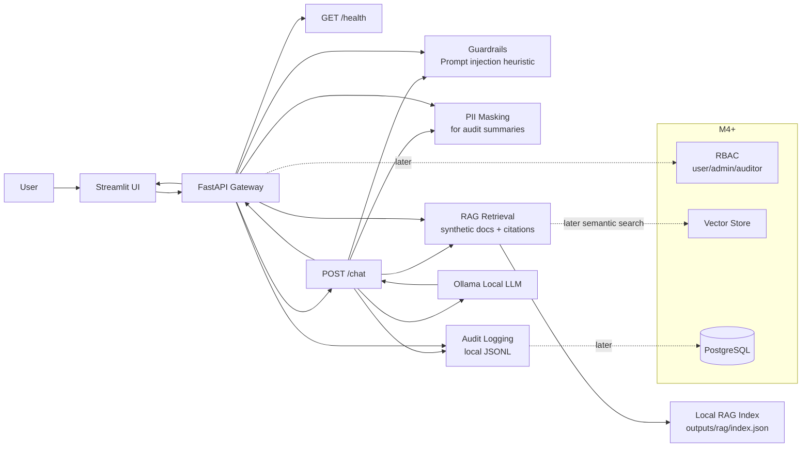

# Closed Local LLM Platform

Hermes Agent と一緒に、closed/local LLM platform の設計と実装を段階的に理解するための学習用実装リポジトリです。

このプロジェクトでは、FastAPI gateway、Streamlit UI、Ollama によるローカル推論、RAG、guardrails、PII masking、audit logging、RBAC を、小さな runnable milestone に分けて実装しながら学びます。

現時点では M3 まで実装済みです。M1 の FastAPI health/chat path、M2 の prompt injection heuristic / PII masking / local JSONL audit logging に加えて、M3 の synthetic sample documents、local RAG ingestion/retrieval、citations、retrieved text の indirect prompt injection metadata を実装しています。UI は日本語を既定表示とし、英語表示にも切り替えられます。

## Why This Project Matters

LLM アプリケーションを closed network や local-first な環境で扱う場合、単にモデルを呼び出すだけでは不十分です。

理解したい問いは次の通りです。

- 推論をローカルまたは閉域に置くと、設計はどう変わるか。
- FastAPI gateway は UI、認可、guardrails、RAG、audit logging、model runtime の間で何を仲介すべきか。
- prompt injection、PII、権限境界、監査ログはどこで扱うべきか。
- Ollama のようなローカル LLM runtime を、Docker Compose と開発体験の中でどう接続するか。
- 最小構成から、RAG、guardrails、RBAC、observability にどう拡張するか。

## Architecture

M3 までの現在構成です。M4 以降の要素は、拡張先として点線で示しています。



## Why This Design?

- Streamlit UI は、ユーザーが closed/local LLM platform を触る入口として使います。M1 では Python/uv ベースの最小 chat UI に留めます。Next.js は必要になった時点で後続 milestone として検討します。
- FastAPI gateway は、UI と local model runtime の間に置く制御点です。guardrails、PII masking、RAG、audit logging をここに集約し、将来の RBAC もここで扱います。
- Ollama は local inference runtime として使います。M1 では接続経路を作り、モデル選択や運用上の制約は README と docs に明記します。
- Docker Compose は、開発者が同じ構成を再現しやすくするために使います。M1 では UI/API wiring を優先し、Ollama を compose 内に含めるか host prerequisite とするかは実装時に明確化します。
- M2 では gateway に guardrails、PII masking、audit logging の最小制御点を追加します。ただし production-grade security ではなく、設計上どこに置くべきかを学ぶための baseline です。
- M3 では synthetic documents と local JSON index による小さな RAG path を追加します。retrieved context は untrusted data として扱い、citations と indirect prompt injection metadata を返します。

## Planned Features

### M1: Smallest runnable local system

- Streamlit UI skeleton
- FastAPI API skeleton
- `GET /health`
- Docker Compose wiring
- Ollama connection path
- basic chat request/response path
- README with Mermaid architecture

### M2: Gateway policy and accountability baseline

- prompt injection heuristic baseline
- Japanese and English prompt injection heuristic baseline
- PII masking/redaction baseline for audit metadata
- audit event schema
- local JSONL audit persistence
- request/response metadata returned by `/chat`

### M3: Local RAG with citations

- synthetic sample documents
- reproducible ingestion into `outputs/rag/index.json`
- lexical retrieval baseline
- citations in `/chat` responses
- retrieved document IDs and retrieval guardrail metadata in audit events
- indirect prompt injection detection for retrieved text
- separated prompt construction for system instructions, user input, and retrieved context

### Later milestones

- M4: RBAC、document-level access boundary、observability/tracing、severity level、block/warn/annotate policy

## Tech Stack

- App entrypoints: `app/api` for FastAPI, `app/streamlit` for Streamlit
- Reusable Python package: `src/closed_llm_platform`
- Backend/API: FastAPI, Python
- UI: Streamlit for M1; Next.js can be revisited in a later UI milestone
- Local LLM runtime: Ollama
- Dependency management: uv with `pyproject.toml` and `uv.lock`
- Infra: Docker, `compose.yml`, VS Code devcontainer
- Testing: pytest, ruff
- RAG: local JSON index and lexical retrieval baseline in M3; vector store planned later
- Data/audit: planned PostgreSQL or local durable store
- Security controls: M2 guardrails/PII/audit baseline, M3 retrieved-context checks, planned RBAC

## Quick Start

Prerequisite: Ollama を host service として起動し、使いたい model を pull しておきます。

```bash
ollama serve
ollama pull qwen3:8b
```

基本コマンド:

```bash
# from repository root
uv sync

# run API
uv run uvicorn app.api.main:app --host 0.0.0.0 --port 8000 --reload

# run Streamlit UI
uv run streamlit run app/streamlit/main.py

# Docker Compose path, using a locally available Ollama model
OLLAMA_MODEL=qwen3:8b docker compose -f compose.yml up --build

# health check
curl http://localhost:8000/health

# ingest sample docs for RAG
uv run python scripts/ingest_documents.py

# chat smoke test
OLLAMA_MODEL=qwen3:8b uv run python scripts/smoke_api.py
```

現時点では M3 まで実装済みです。Ollama は host service prerequisite です。Audit event は default で `outputs/audit/events.jsonl` に生成されます。RAG index は `uv run python scripts/ingest_documents.py` で `outputs/rag/index.json` に生成されます。

## API Plan

| Method | Path | Milestone | Description |
|--------|------|-----------|-------------|
| GET | `/health` | M1 | API process が起動していることを返す health check |
| POST | `/chat` | M3 | UI から chat request を受け取り、optional RAG、guardrail/PII/audit metadata を付与して Ollama に渡す |
| POST | `/documents/ingest` | M3 | synthetic sample documents を local RAG index に取り込む |
| GET | `/audit/events` | M4 | auditor/admin 用の audit event 閲覧予定 |

## Project Structure

M3 実装後の現在構成です。

```text
closed-llm-platform/
  .devcontainer/
    devcontainer.json
  .github/
    ISSUE_TEMPLATE/
    PULL_REQUEST_TEMPLATE.md
  .streamlit/
    config.toml
  app/
    api/
    streamlit/
  data/
  docs/
    architecture.md
    roadmap.md
    setup.md
    threat-model.md
    implementation_M1.md
    implementation_M2.md
    implementation_M3.md
    plans/
  model/
  notebook/
  outputs/
  scripts/
  src/
    closed_llm_platform/
  tests/
  .env.example
  .gitignore
  AGENTS.md
  Dockerfile
  LICENSE
  README.md
  compose.yml
  pyproject.toml
  uv.lock
```

`src/closed_llm_platform/` contains reusable, testable code. `app/` contains executable application entrypoints such as FastAPI and Streamlit. `scripts/` contains helper commands that reuse `src/` code. `data/`, `model/`, and `outputs/` are local/generated artifact areas and should avoid real private data.

## Security Considerations

詳細は `docs/threat-model.md` にまとめます。初期設計で意識する項目は次の通りです。

- Prompt injection: M2 では obvious な injection phrase を heuristic に検出し、metadata/audit に記録する。
- Data leakage: chat response、logs、RAG citations に不要な情報を出さない。
- PII handling: M2 では audit summary 保存前に regex baseline で masking/redaction する。
- RBAC: user/admin/auditor の最小ロールから始める。
- Audit logging: 誰が、いつ、どの操作を、どのモデル/文書に対して行ったかを、PII を抑えた metadata として記録する。
- Local runtime risk: Ollama endpoint を不用意に外部公開しない。
- Supply chain risk: frontend/backend/container dependencies を明示し、不要な依存を増やさない。

## MLOps / Operations Notes

このプロジェクトはモデル学習ではなく local inference platform の理解が中心です。運用面では次を扱います。

- Local model availability and model name configuration
- Request/response observability
- Audit event durability
- Docker Compose reproducibility
- Minimal health checks
- Later: evaluation prompts, regression examples, trace/log review

## Testing / Verification Plan

M3 までの最低限の検証コマンドです。

```bash
# API health
curl -i http://localhost:8000/health

# Python tests and lint
uv run pytest -q
uv run ruff check .

# RAG ingestion
uv run python scripts/ingest_documents.py

# Streamlit UI
uv run streamlit run app/streamlit/main.py

# Compose smoke test
docker compose -f compose.yml up --build
```

## Limitations

- 現時点では M3 までの学習用 baseline 実装があります。
- M2 の guardrails、PII masking、audit logging は production-grade ではありません。
- M3 の RAG は lexical retrieval baseline であり、semantic vector search や document-level RBAC は未実装です。
- Local LLM の品質、速度、メモリ使用量は選択する Ollama model と実行環境に依存します。
- closed/local design を学ぶための実装であり、実運用のセキュリティ保証を提供するものではありません。

## Roadmap

詳細は `docs/roadmap.md` を参照してください。

実装済み M1 のファイル構成、関数・クラスの接続関係、Docker Compose / devcontainer / pytest / Streamlit の使い方は `docs/implementation_M1.md` にまとめています。M2 の guardrails / PII masking / audit logging baseline は `docs/implementation_M2.md` に、M3 の local RAG baseline は `docs/implementation_M3.md` にまとめています。

- [x] M1: UI/API/Ollama/Compose の basic path
- [x] M2: guardrails、PII masking、audit logging baseline
- [x] M3: RAG ingestion/retrieval/citations and indirect prompt injection detection for retrieved text
- [ ] M4: RBAC, observability, severity levels, and block/warn/annotate guardrail policy

## References

- Workbench brief: `../hermes-agent-workbench/projects/closed-llm-platform.md`
- Execution steps: `../hermes-agent-workbench/docs/execution-steps.md`
- README template: `../hermes-agent-workbench/prompts/portfolio-project-readme-template.md`
- FastAPI: https://fastapi.tiangolo.com/
- Streamlit: https://docs.streamlit.io/
- Ollama: https://ollama.com/
