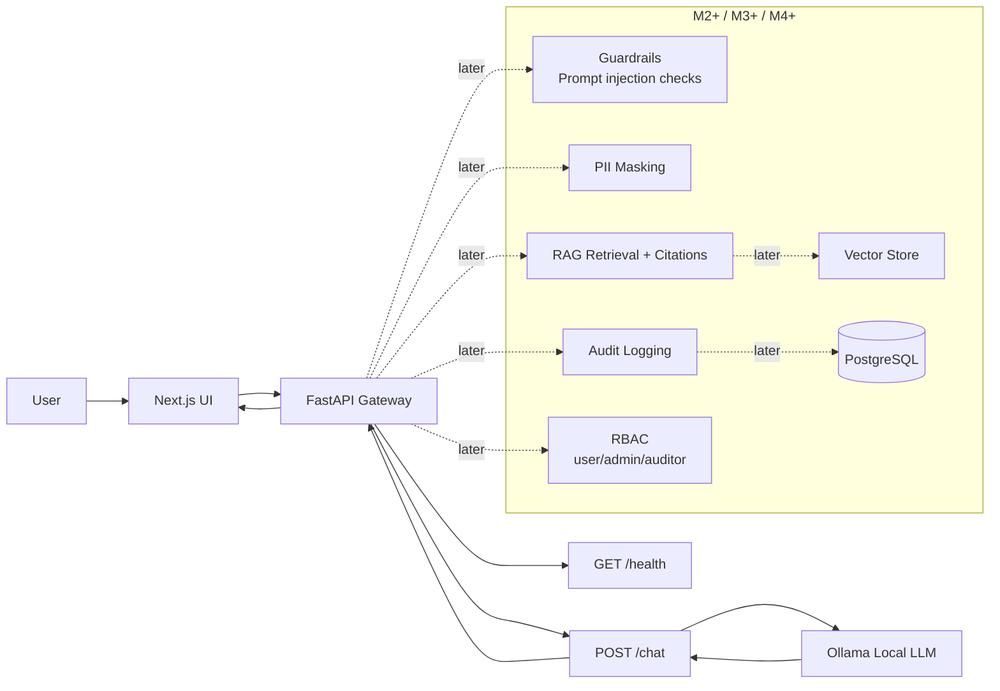

# Closed Local LLM Platform

Hermes Agent と一緒に、closed/local LLM platform の設計と実装を段階的に理解するための学習用実装リポジトリです。

このプロジェクトでは、FastAPI gateway、Next.js UI、Ollama によるローカル推論、RAG、guardrails、PII masking、audit logging、RBAC を、小さな runnable milestone に分けて実装しながら学びます。

現時点では M1 実装前の設計ドキュメントのみを置いています。アプリケーションコードはまだありません。

## Why This Project Matters

LLM アプリケーションを closed network や local-first な環境で扱う場合、単にモデルを呼び出すだけでは不十分です。

理解したい問いは次の通りです。

- 推論をローカルまたは閉域に置くと、設計はどう変わるか。
- FastAPI gateway は UI、認可、guardrails、RAG、audit logging、model runtime の間で何を仲介すべきか。
- prompt injection、PII、権限境界、監査ログはどこで扱うべきか。
- Ollama のようなローカル LLM runtime を、Docker Compose と開発体験の中でどう接続するか。
- 最小構成から、RAG、guardrails、RBAC、observability にどう拡張するか。

## Architecture

M1 で目指す最小構成です。M2 以降の要素も、拡張先として点線で示しています。



## Why This Design?

- Next.js UI は、ユーザーが closed/local LLM platform を触る入口として使います。M1 では最小の chat UI skeleton に留めます。
- FastAPI gateway は、UI と local model runtime の間に置く制御点です。将来の guardrails、PII masking、RAG、RBAC、audit logging をここに集約します。
- Ollama は local inference runtime として使います。M1 では接続経路を作り、モデル選択や運用上の制約は README と docs に明記します。
- Docker Compose は、開発者が同じ構成を再現しやすくするために使います。M1 では UI/API wiring を優先し、Ollama を compose 内に含めるか host prerequisite とするかは実装時に明確化します。
- セキュリティ機能は最初から設計上の場所を確保しますが、M1 では過剰実装しません。まず health check と basic chat path を通します。

## Planned Features

### M1: Smallest runnable local system

- Next.js UI skeleton
- FastAPI API skeleton
- `GET /health`
- Docker Compose wiring
- Ollama connection path
- basic chat request/response path
- README with Mermaid architecture

### Later milestones

- M2: prompt injection guardrails、PII masking baseline、audit log schema、request logging
- M3: sample documents、ingestion、retrieval、citations 付き RAG
- M4: RBAC、document-level access boundary、observability/tracing experiment

## Tech Stack

- App entrypoints: `app/api` for FastAPI, `app/streamlit` for Streamlit
- Reusable Python package: `src/closed_llm_platform`
- Backend/API: FastAPI, Python
- UI: Streamlit for M1; Next.js can be revisited in a later UI milestone
- Local LLM runtime: Ollama
- Dependency management: uv with `pyproject.toml` and `uv.lock`
- Infra: Docker, `compose.yml`, VS Code devcontainer
- Testing: pytest, ruff
- RAG: planned vector store and retrieval layer
- Data/audit: planned PostgreSQL or local durable store
- Security controls: planned guardrails, PII masking, RBAC, audit logging

## Quick Start

M1 実装後に runnable command を確定します。

予定コマンド:

```bash
# from repository root
uv sync

# run API after M1 implementation
uv run uvicorn app.api.main:app --host 0.0.0.0 --port 8000 --reload

# run Streamlit UI after M1 implementation
uv run streamlit run app/streamlit/main.py

# Docker Compose path after M1 implementation
docker compose -f compose.yml up --build

# health check
curl http://localhost:8000/health
```

現時点では設計ドキュメントと repository foundation のみです。まだ FastAPI/Streamlit のアプリ実装はありません。Compose file は `compose.yml` として作成予定です。

## API Plan

| Method | Path | Milestone | Description |
|--------|------|-----------|-------------|
| GET | `/health` | M1 | API process が起動していることを返す health check |
| POST | `/chat` | M1 | UI から basic chat request を受け取り Ollama に渡す |
| POST | `/documents/ingest` | M3 | sample documents を RAG 用に取り込む予定 |
| GET | `/audit/events` | M4 | auditor/admin 用の audit event 閲覧予定 |

## Project Structure

M1 実装後の想定構成です。

```text
closed-llm-platform/
  .devcontainer/
    devcontainer.json
  .github/
    ISSUE_TEMPLATE/
    PULL_REQUEST_TEMPLATE.md
  .streamlit/
    config.toml
  app/
    api/
    streamlit/
  data/
  docs/
    architecture.md
    roadmap.md
    setup.md
    threat-model.md
    plans/
  model/
  notebook/
  outputs/
  scripts/
  src/
    closed_llm_platform/
  tests/
  .env.example
  .gitignore
  AGENTS.md
  Dockerfile
  LICENSE
  README.md
  compose.yml
  pyproject.toml
  uv.lock
```

`src/closed_llm_platform/` contains reusable, testable code. `app/` contains executable application entrypoints such as FastAPI and Streamlit. `scripts/` contains helper commands that reuse `src/` code. `data/`, `model/`, and `outputs/` are local/generated artifact areas and should avoid real private data.

## Security Considerations

詳細は `docs/threat-model.md` にまとめます。初期設計で意識する項目は次の通りです。

- Prompt injection: retrieved documents や user prompt が system/developer intent を上書きしないようにする。
- Data leakage: chat response、logs、RAG citations に不要な情報を出さない。
- PII handling: 入力、検索対象文書、ログ保存前に masking/redaction の責務を明確にする。
- RBAC: user/admin/auditor の最小ロールから始める。
- Audit logging: 誰が、いつ、どの操作を、どのモデル/文書に対して行ったかを記録する。
- Local runtime risk: Ollama endpoint を不用意に外部公開しない。
- Supply chain risk: frontend/backend/container dependencies を明示し、不要な依存を増やさない。

## MLOps / Operations Notes

このプロジェクトはモデル学習ではなく local inference platform の理解が中心です。運用面では次を扱います。

- Local model availability and model name configuration
- Request/response observability
- Audit event durability
- Docker Compose reproducibility
- Minimal health checks
- Later: evaluation prompts, regression examples, trace/log review

## Testing / Verification Plan

M1 実装時の最低限の検証予定です。

```bash
# API health
curl -i http://localhost:8000/health

# API tests, once added
pytest

# Web lint/build, once added
npm run lint
npm run build

# Compose smoke test
docker compose up --build
```

## Limitations

- 現時点ではアプリケーションコードはありません。
- M1 では production-grade authentication、authorization、guardrails、RAG、audit logging はまだ実装しません。
- Local LLM の品質、速度、メモリ使用量は選択する Ollama model と実行環境に依存します。
- closed/local design を学ぶための実装であり、実運用のセキュリティ保証を提供するものではありません。

## Roadmap

詳細は `docs/roadmap.md` を参照してください。

- [ ] M1: UI/API/Ollama/Compose の basic path
- [ ] M2: guardrails、PII masking、audit logging baseline
- [ ] M3: RAG ingestion/retrieval/citations
- [ ] M4: RBAC and observability

## References

- Workbench brief: `../hermes-agent-workbench/projects/closed-llm-platform.md`
- Execution steps: `../hermes-agent-workbench/docs/execution-steps.md`
- README template: `../hermes-agent-workbench/prompts/portfolio-project-readme-template.md`
- FastAPI: https://fastapi.tiangolo.com/
- Next.js: https://nextjs.org/docs
- Ollama: https://ollama.com/
