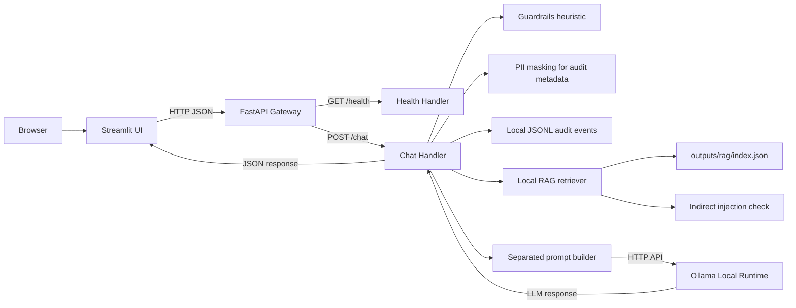
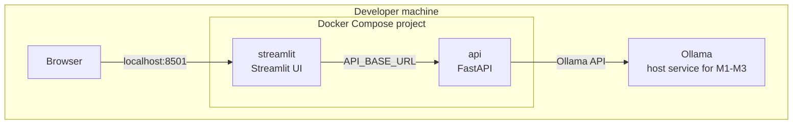
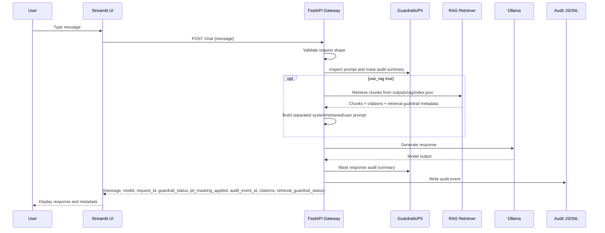
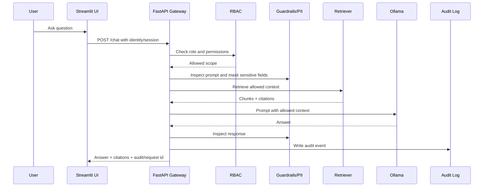

# Architecture

This document describes the current M3 architecture for the Closed Local LLM Platform and the staged direction for later milestones.

The architecture is intentionally staged. M1 created the smallest runnable path. M2 added a first gateway policy/accountability layer. M3 adds local RAG retrieval with citations and retrieved-context safety metadata. Later milestones add stronger access control and observability.

## Goals

- Understand how to place a FastAPI gateway between a UI and a local LLM runtime.
- Keep model inference local or closed-network by default.
- Establish a clean place for guardrails, PII masking, RAG, audit logging, and future RBAC.
- Keep the first implementation small enough to run and verify locally.
- Document design trade-offs as the system evolves.

## Non-Goals for M3

M3 will not implement:

- production authentication
- full RBAC
- database-backed or tamper-resistant audit storage
- advanced prompt injection detection beyond explainable regex heuristics
- production-grade PII detection
- model evaluation framework
- external deployment

Those are intentionally deferred so the RAG baseline stays small and inspectable.

## M3 Logical Architecture

M3 still uses Streamlit for the UI entrypoint. Next.js can be revisited in a later UI milestone if a richer frontend is useful.

## M1-M3 Container / Runtime View

The current local development shape is:

M1-M3 decision: Ollama runs as a host service and is reached from the API container via `host.docker.internal:11434`.
Compose-managed Ollama is intentionally deferred.

## Component Responsibilities

### Streamlit UI

M3 responsibility:

- Render a minimal chat interface.
- Send a prompt to the FastAPI gateway.
- Let the user opt into RAG mode.
- Display the response, model name, request ID, audit event ID, guardrail status, PII masking metadata, retrieval guardrail status, and citations.

Later responsibility:

- Improve citation display for RAG answers.
- Show role-aware controls if needed.
- Surface trace/audit IDs for debugging.

Next.js was part of the initial sketch, but M1 now uses Streamlit to match the requested Python/uv/src-layout project structure.

### FastAPI Gateway

M3 responsibility:

- Expose `GET /health`.
- Expose `POST /documents/ingest`.
- Expose a chat endpoint.
- Inspect prompts with a visible guardrail decision step.
- Mask PII in audit summaries.
- Write local JSONL audit events.
- Optionally retrieve synthetic sample document chunks and build a separated RAG prompt.
- Check retrieved text for indirect prompt injection signals.
- Call Ollama using a configured base URL and model name.
- Return structured JSON responses with M3 metadata and citations.

Later responsibility:

- Enforce authentication and RBAC.
- Apply prompt injection checks.
- Mask or redact PII before persistence and possibly before model calls.
- Orchestrate RAG retrieval and citation formatting.
- Write audit events.
- Add request IDs and observability hooks.

### Ollama Runtime

M1 responsibility:

- Provide local LLM inference.
- Be reachable from the API process.

Later responsibility:

- Support model configuration experiments.
- Provide a stable local inference target for regression prompts.

Ollama should not be exposed as the main user-facing API. The FastAPI gateway is the control point.

### Guardrails Package

M3 responsibility:

- Detect obvious user-prompt injection patterns.
- Detect obvious retrieved-context indirect injection patterns.
- Produce inspectable guardrail decisions.
- Return guardrail status/reasons through `/chat`.

Later responsibility:

- Separate user instructions from retrieved document content.
- Decide whether and how flagged prompts should be blocked or escalated.

This should be simple and explainable first. Avoid an opaque policy engine until the project needs it.

### RAG Package

M3 responsibility:

- Ingest synthetic sample documents.
- Chunk markdown documents.
- Store a local JSON index.
- Retrieve relevant chunks with deterministic lexical scoring.
- Return citations with answers.
- Treat retrieved text as untrusted data and inspect it for indirect prompt injection signals.

RAG should integrate with RBAC later, so retrieval must eventually consider document permissions. M3 does not enforce document-level permissions.

### Audit Baseline

M3 responsibility:

- Record request metadata, actor placeholder, role placeholder, action, model, timestamps, guardrail decisions, hashes, redacted summaries, PII types, RAG usage, retrieved document IDs, citations, retrieval guardrail metadata, and outcome.
- Avoid storing raw secrets or unnecessary PII in audit summaries.

Later responsibility:

- Support auditor/admin review.
- Move from local JSONL to a durable store if needed.

## Data Flow: M3 Chat

## Data Flow: Later Secured/RAG Chat

## Configuration Principles

Use explicit environment variables for runtime choices:

- API host/port
- web API base URL
- Ollama base URL
- Ollama model name
- log level
- sample docs path
- RAG index path
- future database URL

Do not hard-code machine-specific paths or private values.

## Security Boundaries

Primary boundary:

- Users interact with the UI/API, not directly with Ollama.

Future boundaries:

- user/admin/auditor roles
- document-level access for RAG
- audit log read restrictions
- local-only Ollama access
- sanitized logs

## M3 Acceptance Criteria Mapping

| Requirement | Architecture implication |
|-------------|--------------------------|
| Streamlit UI skeleton | `app/streamlit` executable UI entrypoint |
| FastAPI API skeleton | `app/api` executable API entrypoint |
| Reusable Python code | `src/closed_llm_platform` package |
| `/health` endpoint | API health handler |
| Docker Compose wiring | `compose.yml` with local reproducible streamlit + api services |
| Ollama connection path | API can reach configured host Ollama endpoint |
| basic chat path | Streamlit -> API -> guardrails/privacy/audit -> Ollama -> API -> Streamlit |
| M2 guardrail baseline | `src/closed_llm_platform/guardrails.py` and `/chat` metadata |
| M2 PII masking baseline | `src/closed_llm_platform/privacy.py` redacts audit summaries |
| M2 audit logging baseline | `src/closed_llm_platform/audit.py` writes local JSONL events |
| M3 synthetic documents | `data/sample-docs/*.md` contains synthetic-only examples |
| M3 ingestion | `scripts/ingest_documents.py` and `POST /documents/ingest` create `outputs/rag/index.json` |
| M3 retrieval + citations | `src/closed_llm_platform/rag.py` retrieves chunks and returns citation labels |
| M3 indirect injection checks | Retrieved chunks are inspected and response/audit metadata is annotated |
| README with Mermaid architecture | README diagram stays aligned with this file |

## M1/M2/M3 Decisions

- Ollama runs as host service for M1; Compose-managed Ollama is deferred.
- `POST /chat` accepts a minimal JSON request with a `message` field and returns `message`, `model`, and `request_id`.
- uv and src-layout are the Python project standard.
- Streamlit is the M1 UI; Next.js is deferred.
- pytest and ruff are the M1 verification baseline.

## M2/M3 Decisions

- M2 annotates prompt injection signals but does not block prompts yet.
- M2 masks PII for audit summaries, not before model calls.
- M2 audit persistence is local JSONL at `outputs/audit/events.jsonl` by default.
- `actor_id` and `role` remain placeholders until RBAC/auth is introduced.
- M3 uses local JSON lexical retrieval rather than embeddings to keep the retrieval path transparent.
- Retrieved context is annotated, not blocked; block/warn/annotate policy is deferred to M4.
