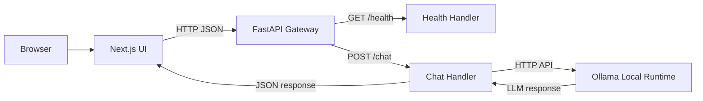
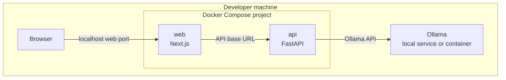
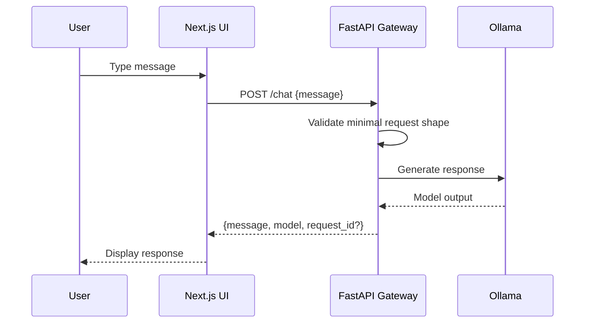
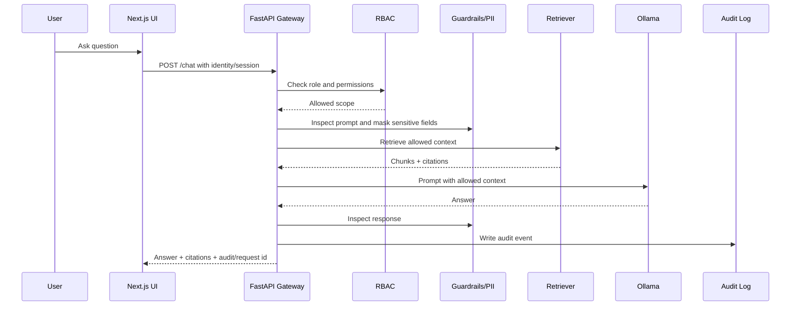

# Architecture

This document describes the intended architecture for the Closed Local LLM Platform before M1 implementation.

The architecture is intentionally staged. M1 creates the smallest runnable path. Later milestones add security, retrieval, auditability, and access control.

## Goals

- Understand how to place a FastAPI gateway between a UI and a local LLM runtime.
- Keep model inference local or closed-network by default.
- Establish a clean place for future guardrails, PII masking, RAG, audit logging, and RBAC.
- Keep the first implementation small enough to run and verify locally.
- Document design trade-offs as the system evolves.

## Non-Goals for M1

M1 will not implement:

- production authentication
- full RBAC
- full RAG ingestion/retrieval
- durable audit log storage
- advanced prompt injection detection
- production-grade PII detection
- model evaluation framework
- external deployment

Those are intentionally deferred so the basic UI/API/Ollama path can work first.

## M1 Logical Architecture

## M1 Container / Runtime View

Exact ports may change during implementation, but the intended local development shape is:

Implementation decision to make in M1:

- Option A: run Ollama on the host and document it as a prerequisite.
- Option B: include Ollama in `docker-compose.yml`.

M1 can choose either, but the README must clearly document the chosen path.

## Component Responsibilities

### Next.js UI

M1 responsibility:

- Render a minimal chat interface.
- Send a prompt to the FastAPI gateway.
- Display the response or error state.

Later responsibility:

- Show citations for RAG answers.
- Show role-aware controls.
- Provide admin/auditor views if needed.
- Surface trace/audit IDs for debugging.

### FastAPI Gateway

M1 responsibility:

- Expose `GET /health`.
- Expose a basic chat endpoint.
- Call Ollama using a configured base URL and model name.
- Return structured JSON responses.

Later responsibility:

- Enforce authentication and RBAC.
- Apply prompt injection checks.
- Mask or redact PII before persistence and possibly before model calls.
- Orchestrate RAG retrieval and citation formatting.
- Write audit events.
- Add request IDs and observability hooks.

### Ollama Runtime

M1 responsibility:

- Provide local LLM inference.
- Be reachable from the API process.

Later responsibility:

- Support model configuration experiments.
- Provide a stable local inference target for regression prompts.

Ollama should not be exposed as the main user-facing API. The FastAPI gateway is the control point.

### Future Guardrails Package

Planned responsibility:

- Detect obvious prompt injection patterns.
- Separate user instructions from retrieved document content.
- Produce inspectable guardrail decisions.

This should be simple and explainable first. Avoid an opaque policy engine until the project needs it.

### Future RAG Package

Planned responsibility:

- Ingest synthetic sample documents.
- Chunk documents.
- Store embeddings or searchable representations.
- Retrieve relevant chunks.
- Return citations with answers.

RAG should integrate with RBAC later, so retrieval must eventually consider document permissions.

### Future Audit Store

Planned responsibility:

- Record request metadata, actor, role, action, model, timestamps, guardrail decisions, document IDs, and outcome.
- Avoid storing raw secrets or unnecessary PII.
- Support auditor/admin review.

## Data Flow: M1 Chat

## Data Flow: Later Secured/RAG Chat

## Configuration Principles

Use explicit environment variables for runtime choices:

- API host/port
- web API base URL
- Ollama base URL
- Ollama model name
- log level
- future database URL

Do not hard-code machine-specific paths or private values.

## Security Boundaries

Primary boundary:

- Users interact with the UI/API, not directly with Ollama.

Future boundaries:

- user/admin/auditor roles
- document-level access for RAG
- audit log read restrictions
- local-only Ollama access
- sanitized logs

## M1 Acceptance Criteria Mapping

| Requirement | Architecture implication |
|-------------|--------------------------|
| Next.js UI skeleton | `apps/web` service/container |
| FastAPI API skeleton | `apps/api` service/container |
| `/health` endpoint | API health handler |
| Docker Compose wiring | local reproducible web + api services |
| Ollama connection path | API can reach configured Ollama endpoint |
| basic chat path | UI -> API -> Ollama -> API -> UI |
| README with Mermaid architecture | README diagram stays aligned with this file |

## Open Decisions for M1

- Whether Ollama runs on host or in Compose.
- Exact route shape for `POST /chat`.
- Whether to use npm, pnpm, or another package manager for Next.js.
- Python dependency tool for FastAPI: plain `requirements.txt`, `uv`, or Poetry.
- Minimal test framework setup in M1.

These should be resolved in the M1 implementation plan before application code is written.
