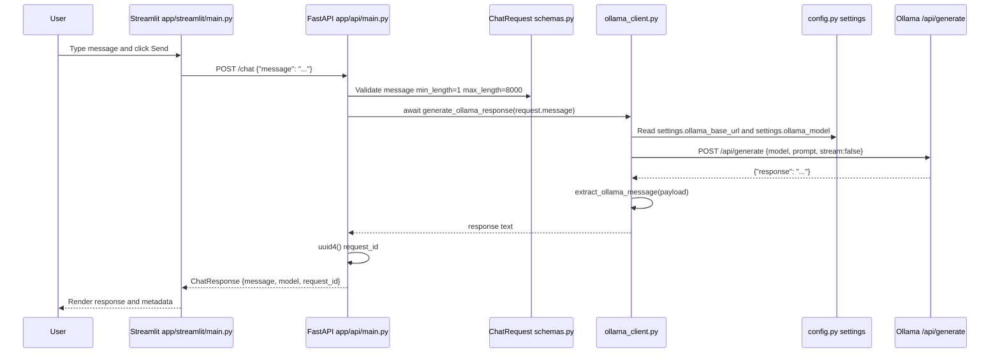
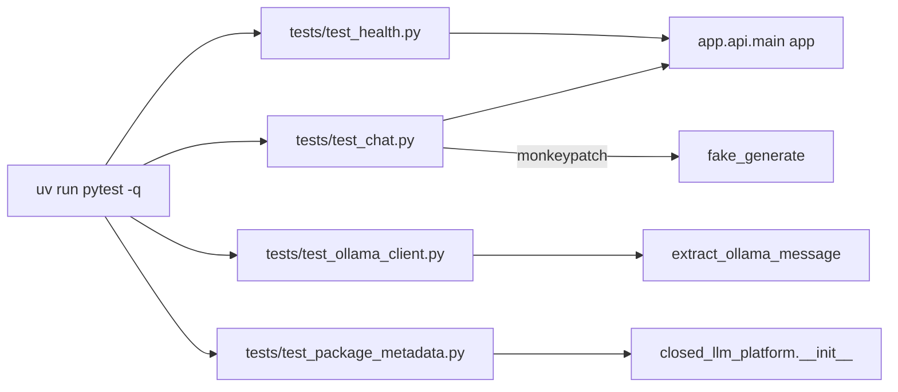
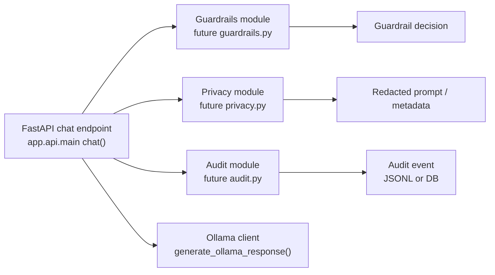

# M1 Implementation Notes

このドキュメントは、M1 までに実装した closed/local LLM platform のファイル構成、実行経路、関数・クラスの接続関係を説明します。

目的は、単に「動くもの」を記録することではなく、FastAPI gateway、Streamlit UI、Docker Compose、devcontainer、pytest、Ollama がどのファイルを介してつながっているかを理解できるようにすることです。

## Current M1 Scope

M1 で実装済みの範囲:

- Streamlit UI skeleton
- FastAPI API skeleton
- `GET /health`
- `POST /chat`
- Ollama host service への接続経路
- Dockerfile / Docker Compose wiring
- VS Code devcontainer support
- pytest / ruff baseline
- smoke script

M1 でまだ実装しないもの:

- production authentication
- full RBAC
- RAG ingestion / retrieval
- durable audit logging
- production guardrails
- production PII masking
- external deployment

## Main Files

| Area | File | Role |
|---|---|---|
| FastAPI entrypoint | `app/api/main.py` | API app、`/health`、`/chat` を定義 |
| Streamlit entrypoint | `app/streamlit/main.py` | Chat UI を表示し、API に HTTP request を送る |
| Runtime config | `src/closed_llm_platform/config.py` | `OLLAMA_BASE_URL`、`OLLAMA_MODEL` を環境変数または `.env` から読む |
| Request/response schema | `src/closed_llm_platform/schemas.py` | `ChatRequest`、`ChatResponse` の Pydantic model |
| Ollama client | `src/closed_llm_platform/ollama_client.py` | Ollama `/api/generate` を呼び出す |
| Package metadata | `src/closed_llm_platform/__init__.py` | package version を公開 |
| Docker image | `Dockerfile` | API / Streamlit 共通 image を build する |
| Docker Compose | `compose.yml` | `api` と `streamlit` service を起動する |
| Devcontainer | `.devcontainer/devcontainer.json` | VS Code Dev Containers 用 Python 環境 |
| Python project | `pyproject.toml` | dependencies、pytest、ruff、src-layout 設定 |
| Lockfile | `uv.lock` | uv dependency lock |
| Env example | `.env.example` | local env var の例 |
| Streamlit config | `.streamlit/config.toml` | Streamlit server/browser 設定 |
| API smoke script | `scripts/smoke_api.py` | `/health` と `/chat` の手動 smoke test |
| Tests | `tests/` | FastAPI endpoint、Ollama response parsing、package metadata のテスト |

## System Flow

M1 の runtime flow は次の通りです。
```mermaid
flowchart LR
  User["User / Browser"] -->|"opens localhost:8501"| Streamlit["Streamlit UI<br/>app/streamlit/main.py"]
  Streamlit -->|"renders page"| BrowserRender["Streamlit rendered page"]
  Streamlit -->|"POST /chat JSON<br/>httpx.post"| API["FastAPI Gateway<br/>app/api/main.py"]
  BrowserRender --> User

  API -->|"validates request"| ChatRequest["ChatRequest<br/>src/closed_llm_platform/schemas.py"]
  API -->|"calls"| OllamaClient["generate_ollama_response()<br/>src/closed_llm_platform/ollama_client.py"]
  OllamaClient -->|"reads"| Settings["settings<br/>src/closed_llm_platform/config.py"]
  Settings -->|"OLLAMA_BASE_URL / OLLAMA_MODEL"| Env[".env or environment variables"]
  OllamaClient -->|"POST /api/generate"| Ollama["Ollama host service<br/>localhost:11434"]
  Ollama -->|"JSON response field"| OllamaClient
  OllamaClient -->|"extract_ollama_message()"| API
  API -->|"ChatResponse"| Streamlit
  Streamlit -->|"display message/model/request_id"| User
  ```

## Container / Compose Flow

Docker Compose では、API と Streamlit は container で動き、Ollama は host machine で動く前提です。

```mermaid
flowchart TB
  subgraph Host[Developer machine]
    Browser[Browser]
    OllamaHost[Ollama host service\nhttp://localhost:11434]

    subgraph Compose[Docker Compose project]
      ApiContainer[api service\nuvicorn app.api.main:app\nport 8000]
      StreamlitContainer[streamlit service\nstreamlit run app/streamlit/main.py\nport 8501]
    end
  end

  Browser -->|http://localhost:8501| StreamlitContainer
  StreamlitContainer -->|API_BASE_URL=http://api:8000| ApiContainer
  ApiContainer -->|OLLAMA_BASE_URL=http://host.docker.internal:11434| OllamaHost
```

Important Compose details:

- `compose.yml` defines two services: `api` and `streamlit`.
- Both services build from the same `Dockerfile`.
- `api` runs:

```bash
uv run uvicorn app.api.main:app --host 0.0.0.0 --port 8000
```

- `streamlit` runs:

```bash
uv run streamlit run app/streamlit/main.py --server.address 0.0.0.0 --server.port 8501
```

- `streamlit` reaches the API with:

```text
API_BASE_URL=http://api:8000
```

- `api` reaches host Ollama with:

```text
OLLAMA_BASE_URL=http://host.docker.internal:11434
```

- `extra_hosts` maps `host.docker.internal` for Docker environments that need an explicit host-gateway mapping.

## Request / Response Sequence

`POST /chat` の内部 sequence です。



## FastAPI Implementation

File: `app/api/main.py`

### `app = FastAPI(...)`

This creates the FastAPI application object used by uvicorn and tests.

Used by:

- `uv run uvicorn app.api.main:app ...`
- `tests/test_health.py`
- `tests/test_chat.py`

### `health() -> dict[str, str]`

Route:

```python
@app.get("/health")
def health() -> dict[str, str]:
    return {"status": "ok"}
```

Purpose:

- Verifies that the API process is running.
- Does not expose environment details or model configuration.

Test:

- `tests/test_health.py::test_health_returns_ok_status`

### `chat(request: ChatRequest) -> ChatResponse`

Route:

```python
@app.post("/chat", response_model=ChatResponse)
async def chat(request: ChatRequest) -> ChatResponse:
    message = await generate_ollama_response(request.message)
    return ChatResponse(
        message=message,
        model=settings.ollama_model,
        request_id=str(uuid4()),
    )
```

Responsibilities:

1. Receive a validated `ChatRequest`.
2. Call `generate_ollama_response()`.
3. Wrap the model output into `ChatResponse`.
4. Include `settings.ollama_model` and a generated `request_id`.

Dependencies:

- `ChatRequest` and `ChatResponse` from `src/closed_llm_platform/schemas.py`
- `generate_ollama_response()` from `src/closed_llm_platform/ollama_client.py`
- `settings` from `src/closed_llm_platform/config.py`
- `uuid4()` from Python stdlib

Tests:

- `tests/test_chat.py::test_chat_requires_non_empty_message`
- `tests/test_chat.py::test_chat_returns_model_response`

The second test monkeypatches `app.api.main.generate_ollama_response`, so endpoint behavior can be tested without requiring a live Ollama runtime.

## Streamlit Implementation

File: `app/streamlit/main.py`

Top-level constants and setup:

```python
API_BASE_URL = os.getenv("API_BASE_URL", "http://localhost:8000")
st.set_page_config(page_title="Closed Local LLM Platform", page_icon="🔒")
```

UI elements:

- `st.title(...)`
- `st.caption(...)`
- `st.info(...)`
- `st.text_area(...)`
- `st.button(...)`

When the user clicks Send:

```python
response = httpx.post(
    f"{API_BASE_URL}/chat",
    json={"message": message.strip()},
    timeout=90.0,
)
```

Then Streamlit displays:

- `body["message"]`
- `body["model"]`
- `body["request_id"]`

Runtime difference:

- Local non-Docker default: `API_BASE_URL=http://localhost:8000`
- Docker Compose: `API_BASE_URL=http://api:8000`

## Config Implementation

File: `src/closed_llm_platform/config.py`

### `Settings(BaseSettings)`

```python
class Settings(BaseSettings):
    ollama_base_url: str = "http://host.docker.internal:11434"
    ollama_model: str = "llama3.2"

    model_config = SettingsConfigDict(env_file=".env", extra="ignore")
```

Responsibilities:

- Read runtime configuration from environment variables.
- Read `.env` when present.
- Ignore extra `.env` variables not modeled here.

Important fields:

- `settings.ollama_base_url`
- `settings.ollama_model`

`settings = Settings()` creates one shared settings object imported by API and Ollama client code.

Related files:

- `.env.example`
- `compose.yml`
- `app/api/main.py`
- `src/closed_llm_platform/ollama_client.py`

## Schema Implementation

File: `src/closed_llm_platform/schemas.py`

### `ChatRequest(BaseModel)`

```python
class ChatRequest(BaseModel):
    message: str = Field(min_length=1, max_length=8000)
```

Purpose:

- Validate incoming chat request body.
- Reject empty messages with FastAPI/Pydantic validation error.
- Limit M1 prompt size to 8000 characters.

### `ChatResponse(BaseModel)`

```python
class ChatResponse(BaseModel):
    message: str
    model: str
    request_id: str
```

Purpose:

- Define the API response shape for `/chat`.
- Keep response explicit and easy to extend later with guardrail, audit, or citation fields.

## Ollama Client Implementation

File: `src/closed_llm_platform/ollama_client.py`

### `extract_ollama_message(payload: dict) -> str`

```python
def extract_ollama_message(payload: dict) -> str:
    response = payload.get("response")
    if not isinstance(response, str):
        raise ValueError("Ollama response payload missing string 'response'")
    return response
```

Purpose:

- Extract the `response` field from Ollama `/api/generate` response JSON.
- Fail clearly if Ollama returns an unexpected shape.

Tests:

- `tests/test_ollama_client.py::test_extract_ollama_message_from_generate_response`
- `tests/test_ollama_client.py::test_extract_ollama_message_rejects_missing_response`

### `generate_ollama_response(message: str) -> str`

```python
async def generate_ollama_response(message: str) -> str:
    async with httpx.AsyncClient(timeout=60.0) as client:
        response = await client.post(
            f"{settings.ollama_base_url}/api/generate",
            json={
                "model": settings.ollama_model,
                "prompt": message,
                "stream": False,
            },
        )
        response.raise_for_status()
        return extract_ollama_message(response.json())
```

Purpose:

- Call Ollama using the configured base URL and model.
- Use non-streaming generation for M1 simplicity.
- Raise HTTP errors instead of swallowing connection/model failures.
- Return only the model response text to the API layer.

## Dependency and Tooling Configuration

File: `pyproject.toml`

### Project dependencies

```toml
dependencies = [
    "fastapi==0.115.6",
    "httpx==0.28.1",
    "pydantic-settings==2.7.1",
    "streamlit==1.41.1",
    "uvicorn[standard]==0.34.0",
]
```

These support:

- FastAPI API runtime
- HTTP calls from Streamlit and Ollama client
- environment-based settings
- Streamlit UI runtime
- uvicorn ASGI server

### Dev dependencies

```toml
[dependency-groups]
dev = [
    "pytest==8.3.4",
    "pytest-asyncio==0.25.2",
    "ruff==0.9.2",
]
```

These support:

- test execution
- async test compatibility
- linting and import sorting checks

### src-layout / pytest config

```toml
[tool.setuptools.packages.find]
where = ["src"]

[tool.pytest.ini_options]
pythonpath = [".", "src"]
testpaths = ["tests"]
```

`pythonpath = [".", "src"]` lets tests import both:

- `app.api.main`
- `closed_llm_platform.*`

## Dockerfile

File: `Dockerfile`

Build steps:

1. Start from `python:3.12-slim`.
2. Set `/workspace` as working directory.
3. Install `uv`.
4. Copy project metadata and source/app files.
5. Run `uv sync --frozen` using `uv.lock`.
6. Expose 8000 and 8501.
7. Default command runs FastAPI via uvicorn.

Both Compose services use this same image, but override the command:

- `api` command runs uvicorn.
- `streamlit` command runs Streamlit.

This keeps M1 simple: one Docker image, two runtime commands.

## Docker Compose

File: `compose.yml`

### `api` service

```yaml
api:
  build:
    context: .
  command: uv run uvicorn app.api.main:app --host 0.0.0.0 --port 8000
  environment:
    OLLAMA_BASE_URL: http://host.docker.internal:11434
    OLLAMA_MODEL: ${OLLAMA_MODEL:-llama3.2}
  ports:
    - "8000:8000"
  extra_hosts:
    - "host.docker.internal:host-gateway"
```

Purpose:

- Starts the FastAPI gateway.
- Exposes it at `http://localhost:8000`.
- Points to host Ollama.
- Allows model override with `OLLAMA_MODEL=...`.

### `streamlit` service

```yaml
streamlit:
  build:
    context: .
  command: uv run streamlit run app/streamlit/main.py --server.address 0.0.0.0 --server.port 8501
  environment:
    API_BASE_URL: http://api:8000
  ports:
    - "8501:8501"
  depends_on:
    - api
```

Purpose:

- Starts the Streamlit UI.
- Exposes it at `http://localhost:8501`.
- Calls the API by service name inside the Compose network.

## Devcontainer

File: `.devcontainer/devcontainer.json`

Purpose:

- Provides a VS Code Dev Containers environment using Python 3.12.
- Adds Docker-outside-of-Docker support so Docker commands can be run from inside the devcontainer.
- Installs uv after container creation and runs `uv sync`.
- Installs useful VS Code extensions:
  - Python
  - Pylance
  - Ruff
  - Docker
- Forwards ports:
  - 8000: FastAPI
  - 8501: Streamlit
  - 11434: Ollama

Important setting:

```json
"postCreateCommand": "pipx install uv || pip install --user uv; uv sync"
```

This makes a fresh devcontainer ready for the same commands used locally.

## Streamlit Config

File: `.streamlit/config.toml`

```toml
[server]
headless = true
address = "0.0.0.0"
port = 8501

[browser]
gatherUsageStats = false
```

Purpose:

- Makes Streamlit suitable for local/container execution.
- Binds to all interfaces inside the container.
- Disables Streamlit usage stats gathering.

## Smoke Script

File: `scripts/smoke_api.py`

Function:

```python
def main() -> int:
```

Flow:

1. Read `API_BASE_URL` from environment, defaulting to `http://localhost:8000`.
2. `GET /health`.
3. Print health response.
4. `POST /chat` with a short message.
5. Print chat response.

Use it after API is running:

```bash
OLLAMA_MODEL=qwen3:8b uv run python scripts/smoke_api.py
```

In Compose, if running from the host, the default `API_BASE_URL=http://localhost:8000` works.

## Test Coverage

Current tests:

| Test file | What it verifies |
|---|---|
| `tests/test_health.py` | `GET /health` returns `{"status":"ok"}` |
| `tests/test_chat.py` | empty message is rejected; `/chat` returns message/model/request_id when Ollama call is monkeypatched |
| `tests/test_ollama_client.py` | Ollama response parsing succeeds/fails as expected |
| `tests/test_package_metadata.py` | package version aliases are exposed |

Test flow:



Important testing choice:

- Unit tests do not require Ollama to be running.
- End-to-end smoke testing does require Ollama and a pulled model.

## Verification Commands

### Local Python verification

```bash
uv sync
uv run ruff check .
uv run pytest -q
```

Expected current result:

```text
All checks passed!
6 passed
```

### Run API locally

```bash
uv run uvicorn app.api.main:app --host 0.0.0.0 --port 8000 --reload
curl -i http://localhost:8000/health
```

Expected health response:

```text
HTTP/1.1 200 OK
{"status":"ok"}
```

### Run Streamlit locally

```bash
uv run streamlit run app/streamlit/main.py
```

Then open:

```text
http://localhost:8501
```

### Run with Docker Compose

Make sure Docker daemon and Ollama are running, and use a model that exists locally:

```bash
ollama list
OLLAMA_MODEL=qwen3:8b docker compose -f compose.yml up --build
```

Then verify:

```bash
curl -i http://localhost:8000/health
curl -I http://localhost:8501
OLLAMA_MODEL=qwen3:8b uv run python scripts/smoke_api.py
```

Stop services:

```bash
docker compose -f compose.yml down
```

## Known M1 Trade-offs

- Ollama is not managed by Compose yet. It is a host prerequisite.
- `/chat` uses Ollama `/api/generate` with `stream: false`; streaming is deferred.
- There is no durable audit store yet.
- `request_id` is returned but not persisted.
- There is no RBAC or authentication.
- Guardrails and PII masking are documented as future M2 work, not implemented in M1.
- The UI is Streamlit for speed and learning clarity; Next.js can be revisited later if richer frontend behavior is useful.

## Extension Points for M2+

The current connection points are intentionally simple:



Likely M2 files:

- `src/closed_llm_platform/guardrails.py`
- `src/closed_llm_platform/privacy.py`
- `src/closed_llm_platform/audit.py`
- `tests/test_guardrails.py`
- `tests/test_privacy.py`
- `tests/test_audit.py`

M2 should keep the gateway as the control point: UI and Ollama should not become the place where policy decisions are enforced.
