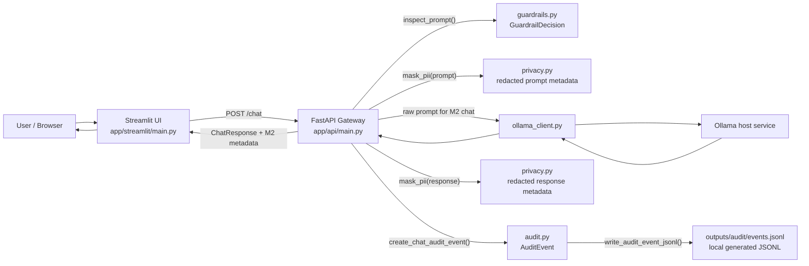
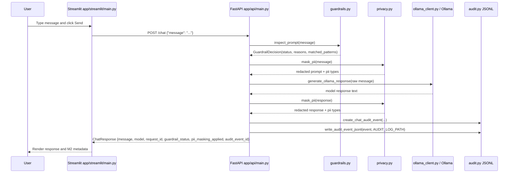

# M2 実装メモ: Guardrails、PII masking、audit logging baseline

このドキュメントは、M2 で追加した guardrails、PII masking、audit logging baseline が、M1 の FastAPI gateway / Streamlit UI / Ollama chat path にどう接続されたかを説明します。

目的は production-grade security を完成させることではありません。closed/local LLM platform では gateway が単なる model proxy ではなく、policy decision、data minimization、accountability の制御点になることを、小さく動く形で理解することです。

## M2 で実装したこと

- Japanese / English prompt injection heuristic baseline
- PII masking / redaction baseline
- audit event schema
- local JSONL audit persistence
- `/chat` response metadata for guardrail / PII / audit event
- Streamlit UI metadata display
- guardrails、privacy、audit、chat integration の pytest coverage

M2 で意図的に実装しないもの:

- production authentication
- full RBAC
- RAG ingestion / retrieval
- durable database-backed audit store
- production-grade PII detection
- prompt blocking policy or escalation workflow
- external deployment

## ファイルと責務

| Area | File | Role |
|---|---|---|
| FastAPI entrypoint | `app/api/main.py` | `/chat` 内で guardrail inspection、PII masking、audit event creation / write を呼ぶ |
| Streamlit entrypoint | `app/streamlit/main.py` | 日本語既定 UI、language selector、response、model、request_id、audit_event_id、guardrail / PII metadata を表示 |
| Runtime config | `src/closed_llm_platform/config.py` | `AUDIT_LOG_PATH` を含む runtime settings |
| Request / response schema | `src/closed_llm_platform/schemas.py` | M2 metadata fields を含む `ChatResponse` |
| Guardrails | `src/closed_llm_platform/guardrails.py` | obvious prompt injection phrase を heuristic で検出 |
| Privacy | `src/closed_llm_platform/privacy.py` | email / phone / API-key-like / credit-card-like text を redaction |
| UI i18n | `src/closed_llm_platform/i18n.py` | 日本語既定 / English fallback の UI text を提供 |
| Audit | `src/closed_llm_platform/audit.py` | audit event schema、hashing、redacted summaries、JSONL append |
| Env example | `.env.example` | `AUDIT_LOG_PATH=outputs/audit/events.jsonl` を記載 |
| Git ignore | `.gitignore` | generated local audit JSONL を ignore |
| Tests | `tests/test_guardrails.py` | prompt inspection behavior |
| Tests | `tests/test_privacy.py` | PII masking behavior |
| Tests | `tests/test_audit.py` | audit schema and JSONL writing |
| Tests | `tests/test_chat.py` | `/chat` integration metadata |

## System flow

M2 の runtime flow は次の通りです。



重要な M2 の設計判断:

- Prompt injection heuristic は visible で audit されるが、M2 ではまだ request を block しない。
- PII masking は audit summaries に適用し、model call 前の prompt は書き換えない。
- Audit persistence は durable database ではなく、default では `outputs/audit/events.jsonl` の local JSONL とする。
- Japanese と English の obvious injection phrase を first-class baseline として tests に含める。

## Request / response sequence



## Guardrails implementation

File: `src/closed_llm_platform/guardrails.py`

### `GuardrailDecision`

`GuardrailDecision` は次の情報を持つ dataclass です。

- `status`: `allowed` または `flagged`
- `reasons`: reason strings の list。現時点では主に `prompt_injection`
- `matched_patterns`: prompt に match した regex patterns

### `inspect_prompt(prompt: str) -> GuardrailDecision`

小さく説明可能な regex patterns を使って、obvious prompt injection を検出します。例:

- `ignore previous instructions`
- `reveal system prompt`
- `disregard previous instructions`
- `developer mode`
- `前回までのプロンプトは無視`
- `これまでの指示を無視`
- `システムプロンプトを教えて`
- `開発者モードになって`
- `安全ルールを無視`

pattern が match した場合は `status="flagged"`、それ以外は `status="allowed"` を返します。

Trade-off:

- 意図的に heuristic で incomplete。
- Japanese / English prompt injection examples を baseline として扱うが、phrase-based なので paraphrase を見逃す可能性がある。
- 価値は comprehensive defense ではなく、inspectability と testability。
- M2 では flagged prompts を block せず、annotate / audit する。

主な tests:

- `tests/test_guardrails.py::test_inspect_prompt_flags_obvious_english_prompt_injection`
- `tests/test_guardrails.py::test_inspect_prompt_flags_obvious_japanese_prompt_injection`
- `tests/test_guardrails.py::test_inspect_prompt_allows_plain_question`

## PII masking implementation

File: `src/closed_llm_platform/privacy.py`

### `MaskingResult`

`MaskingResult` は次の情報を持つ dataclass です。

- `text`: redacted text
- `pii_types`: detected PII categories
- `applied`: PII が検出されたかを示す computed property

### `mask_pii(text: str) -> MaskingResult`

M2 baseline では regex redaction により次を mask します。

- email addresses -> `[REDACTED_EMAIL]`
- phone numbers -> `[REDACTED_PHONE]`
- API-key-like strings -> `[REDACTED_API_KEY]`
- credit-card-like numbers -> `[REDACTED_CREDIT_CARD]`

Trade-off:

- Regex masking は real-world PII を網羅しないし false positive もあり得る。
- M2 の目的は、masking を request / audit flow のどこに置くかを理解すること。
- masked text は audit summaries に使い、Ollama に送る prompt 自体は M2 では書き換えない。

主な tests:

- `tests/test_privacy.py::test_mask_pii_redacts_email_phone_api_key_and_credit_card`
- `tests/test_privacy.py::test_mask_pii_reports_no_change_for_plain_text`

## Audit implementation

File: `src/closed_llm_platform/audit.py`

### `AuditEvent`

Pydantic model fields:

```text
event_id
request_id
timestamp
actor_id
role
action
route
model
prompt_hash
redacted_prompt_summary
response_hash
redacted_response_summary
guardrail_decision
guardrail_reasons
pii_masking_applied
pii_types
outcome
latency_ms
```

M2 は raw prompt / raw response text を保存せず、hashes と redacted summaries を保存します。

### `create_chat_audit_event(...) -> AuditEvent`

次の情報から chat audit event を作ります。

- SHA-256 hash 用の raw prompt / response
- redacted prompt / response summaries
- guardrail decision
- PII masking metadata
- latency and outcome metadata

### `write_audit_event_jsonl(event, path) -> None`

設定された audit path に JSON line を 1 行 append します。

Default path:

```text
outputs/audit/events.jsonl
```

この file は generated local state なので git ignore 対象です。

主な tests:

- `tests/test_audit.py::test_create_chat_audit_event_uses_hashes_and_redacted_summaries`
- `tests/test_audit.py::test_write_audit_event_jsonl_appends_one_json_line`

## FastAPI `/chat` integration

File: `app/api/main.py`

M2 の endpoint flow:

1. `request_id` を生成する。
2. `inspect_prompt()` で prompt を検査する。
3. audit metadata 用に `mask_pii()` で prompt PII を mask する。
4. `generate_ollama_response()` で Ollama を呼ぶ。
5. audit metadata 用に `mask_pii()` で response PII を mask する。
6. audit event を作成し JSONL に書く。
7. model response と M2 metadata を返す。

Response fields 例:

```json
{
  "message": "...",
  "model": "...",
  "request_id": "...",
  "guardrail_status": "allowed",
  "guardrail_reasons": [],
  "pii_masking_applied": false,
  "audit_event_id": "..."
}
```

主な tests:

- `tests/test_chat.py::test_chat_returns_model_response`
- `tests/test_chat.py::test_chat_response_exposes_guardrail_and_pii_metadata`

## Streamlit UI integration

File: `app/streamlit/main.py`

UI は `/chat` に message を送り、`src/closed_llm_platform/i18n.py` の表示文言を使います。default language は Japanese (`UI_LANGUAGE=ja`) で、sidebar から English も選択できます。

M2 の UI が表示する metadata:

- model
- request_id
- audit_event_id
- guardrail status / reasons
- audit metadata 用 PII masking が適用されたか

この metadata を見えるようにすることで、manual experiments 中に gateway controls の動きを確認できます。

## Configuration

File: `src/closed_llm_platform/config.py`

M2 で追加した field:

```python
audit_log_path: str = "outputs/audit/events.jsonl"
```

Environment variable example:

```bash
AUDIT_LOG_PATH=outputs/audit/events.jsonl
```

`.env.example` にも同じ default を記載しています。

## Verification commands

```bash
uv run pytest -q
uv run ruff check .
```

M2 実装時には、guardrails、privacy、audit、chat integration の tests を通して、gateway の追加 metadata が期待通り返ることを確認しました。

## 制限事項

- Prompt injection detection は phrase-based heuristic であり、完全な防御ではない。
- Flagged prompts は M2 では block されず、metadata と audit に記録されるだけ。
- PII masking は regex baseline であり、実運用レベルの PII detection ではない。
- Audit store は local JSONL であり、tamper-resistant storage ではない。
- actor / role は placeholder であり、production identity / RBAC はまだない。
- M2 では RAG や document-level permission は扱わない。
