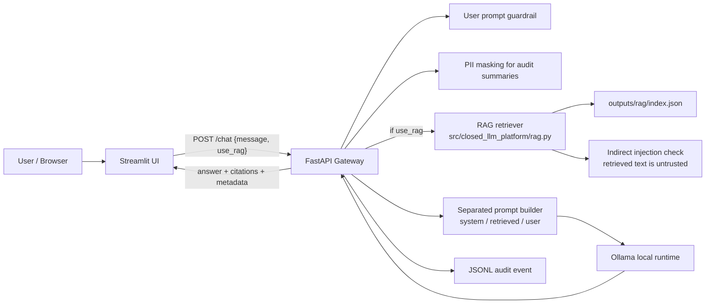

# M3 実装メモ: citations 付き local RAG

このドキュメントは、M3 で追加した小さく検証しやすい RAG path を説明します。
目的は production-grade RAG を作ることではなく、retrieval を入れることで prompt construction、citations、audit metadata、prompt injection risk がどう変わるかを、local JSON index で観察できるようにすることです。

## M3 で実装したこと

- `data/sample-docs/` 配下の synthetic markdown sample documents
- `outputs/rag/index.json` への再現可能な local JSON index 生成
- deterministic な markdown chunking
- English / Japanese の語句に対応する簡易 lexical retrieval
- `POST /chat` の optional RAG mode (`use_rag: true`)
- `ChatResponse` の citations
- audit event における retrieved document IDs と citation labels
- retrieved chunks に対する indirect prompt injection check
- system instructions、untrusted retrieved context、user question を分ける prompt construction

M3 で意図的に実装しないもの:

- vector embeddings
- production vector database
- document-level RBAC
- production authentication
- deterministic local labels を超える citation verification
- indirect injection を block する policy

## ファイルと責務

```text
data/sample-docs/
  synthetic markdown documents。実データや private documents は置かない。

src/closed_llm_platform/rag.py
  DocumentChunk model、markdown loading、chunking、lexical retrieval、
  retrieved-context guardrail checks、RAG prompt construction、JSON index I/O。

scripts/ingest_documents.py
  data/sample-docs/ から outputs/rag/index.json を生成する CLI helper。

app/api/main.py
  POST /documents/ingest と、POST /chat 内の optional RAG flow を追加。

src/closed_llm_platform/schemas.py
  use_rag request flag、citation / retrieval metadata response fields、
  DocumentIngestResponse を追加。

src/closed_llm_platform/audit.py
  rag_used、retrieved_document_ids、citations、retrieval guardrail metadata を追加。

app/streamlit/main.py
  RAG checkbox を追加し、API から返る citations と retrieval metadata を表示。
```

## Runtime flow



重要な設計点:

- RAG は default では無効で、request の `use_rag: true` で有効化する。
- retrieved text は trusted instructions ではなく untrusted data として扱う。
- M3 の retrieval は semantic search ではなく、動作を追いやすい lexical baseline とする。
- flagged retrieved context は M3 では block せず、response / audit metadata に出す。

## Request / response shape

RAG なしの最小 request は引き続き有効です。

```json
{
  "message": "What is a local LLM gateway?"
}
```

RAG を使う request:

```json
{
  "message": "How does the gateway use audit logs?",
  "use_rag": true
}
```

M3 の response fields には次が含まれます。

```text
rag_used
citations
retrieved_document_ids
retrieval_guardrail_status
retrieval_guardrail_reasons
```

## Ingestion

sample documents から local RAG index を作るには次を実行します。

```bash
uv run python scripts/ingest_documents.py
```

期待される出力:

```text
Ingested 3 document(s) into 3 chunk(s): outputs/rag/index.json
```

`outputs/rag/index.json` は generated local state なので git ignore 対象です。source document である `data/sample-docs/*.md` は synthetic sample として commit 対象です。

API から ingestion する場合:

```bash
curl -X POST http://localhost:8000/documents/ingest
```

## Prompt construction の選択

M3 では retrieved text を user message にそのまま連結しません。
`build_rag_prompt()` は次の 3 section を明示的に作ります。

```text
SYSTEM INSTRUCTIONS
UNTRUSTED RETRIEVED CONTEXT
USER QUESTION
```

この分離により、学習上のポイントを見えるようにしています。retrieved documents は「命令」ではなく「参照データ」です。将来、RBAC や document permission を追加する場合も、この境界を保つことが重要です。

## Indirect prompt injection handling

M3 は M2 の rule-based prompt inspection baseline を retrieved chunks にも適用します。retrieved chunk に obvious な English / Japanese injection language が含まれる場合でも、M3 では request を block しません。その代わり response / audit metadata に次のような情報を入れます。

```text
retrieval_guardrail_status=flagged
retrieval_guardrail_reasons=["indirect_prompt_injection"]
```

block / warn / annotate の policy は M4 以降に延期しています。M3 では「retrieved context も攻撃面になる」という事実を、metadata と tests で観察できるようにすることを優先します。

## Audit metadata

RAG を使った `/chat` request では、audit event に M2 の metadata に加えて次を記録します。

```text
rag_used
retrieved_document_ids
citations
retrieval_guardrail_decision
retrieval_guardrail_reasons
```

audit event は raw prompt / raw response を保存せず、hashes と redacted summaries を使います。RAG metadata も、どの document/chunk が使われたかを後から確認するための最小情報として扱います。

## Streamlit UI

M3 の UI では次を追加しています。

- RAG を有効化する checkbox
- response に紐づく citations の表示
- retrieved document IDs の表示
- retrieval guardrail status / reasons の表示

UI は learning/debugging 用に metadata を見えるようにしています。production UI としての情報量や表示設計は M4 以降の検討対象です。

## Verification commands

```bash
uv run pytest -q
uv run ruff check .
uv run python scripts/ingest_documents.py
```

実装時の検証結果:

```text
31 passed
All checks passed!
Ingested 3 document(s) into 3 chunk(s): outputs/rag/index.json
```

Docker image に `scripts/` と `data/sample-docs/` が含まれることも build で確認しました。

```bash
docker compose -f compose.yml build
```

## 制限事項

- Retrieval は lexical / deterministic baseline であり、semantic embedding search ではない。
- Japanese retrieval は簡易 character n-gram baseline であり、language-aware tokenizer ではない。
- Indirect injection detection は regex-based で、微妙な攻撃や paraphrase を見逃す可能性がある。
- RAG はまだ document-level permissions を enforce しない。
- sample documents は synthetic で、意図的に小さくしている。
- flagged retrieved context は M3 では block されず、metadata として返るだけ。
- citations は local deterministic labels であり、外部ソースの真正性検証ではない。
