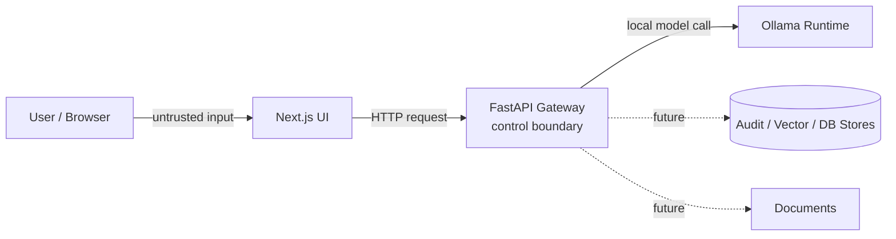

# Threat Model

This is an initial threat model for the Closed Local LLM Platform before M1 implementation.

It is intentionally practical and milestone-aware. M1 will not solve every risk, but the design should leave clear places to add controls.

## Scope

In scope:

- Next.js UI
- FastAPI gateway
- Ollama local runtime connection
- chat request/response flow
- future guardrails
- future PII masking
- future RAG over synthetic documents
- future audit logging
- future RBAC
- Docker Compose local development environment

Out of scope for now:

- production cloud deployment
- enterprise identity provider integration
- real private company documents
- real user PII datasets
- compliance certification
- production incident response process

## Assets

Important things to protect:

- User prompts
- Model responses
- Retrieved document chunks
- Synthetic sample documents, and later any private documents if added intentionally
- Audit logs
- Role and permission metadata
- Model configuration
- Local service endpoints
- Developer machine secrets and environment variables

## Actors

### Normal user

Uses the UI to ask questions and receive answers.

### Admin

Future role. Manages system settings, documents, model configuration, or users.

### Auditor

Future role. Reviews audit events but should not necessarily have broad document access.

### Malicious or careless user

May attempt prompt injection, data exfiltration, overbroad retrieval, or unsafe requests.

### Compromised dependency or container

May attempt to read environment variables, alter responses, or exfiltrate logs/data.

### Developer

Can accidentally commit secrets, real data, or insecure defaults.

## Trust Boundaries

Primary control boundary:

- FastAPI gateway.

The UI should not be trusted to enforce security rules by itself. Ollama should not be exposed as the direct user-facing API.

## Key Threats and Initial Controls

| Threat | Example | M1 position | Later control |
|--------|---------|-------------|---------------|
| Prompt injection | User says "ignore previous instructions" | Document as known risk | Guardrail checks, prompt separation, regression examples |
| RAG injection | Retrieved doc contains malicious instructions | Not in M1 | Treat retrieved text as data, citations, guardrail review |
| PII leakage | Raw email/phone/token appears in logs | Avoid real data | PII masking before persistence, redacted audit summaries |
| Audit log leakage | Logs store full prompts with secrets | Avoid logging sensitive content in M1 | Audit schema with redaction and hashes/summaries |
| Unauthorized access | User reads admin/audit data | No RBAC in M1 | user/admin/auditor roles and route enforcement |
| Document over-retrieval | RAG returns docs outside user scope | Not in M1 | document-level permissions and retrieval filters |
| Direct model exposure | Ollama accessible from network | Keep local by default | bind to localhost/private network, gateway-only access |
| Supply chain risk | malicious npm/Python package | Minimal dependencies | lockfiles, dependency review, CI checks |
| Hallucination | Model invents facts | Known limitation | citations, uncertainty language, eval prompts |
| Denial of service | Large prompts or repeated requests | Basic local dev only | request size limits, timeouts, rate limits |

## STRIDE Notes

### Spoofing

Risk:

- A caller may claim a role or identity without proof once roles are introduced.

M1:

- No production identity model.

Later:

- Do not trust client-supplied role blindly.
- Add a minimal server-side identity/session abstraction before enforcing RBAC.

### Tampering

Risk:

- User input or retrieved documents may alter prompt intent.
- Container or dependency tampering may alter API behavior.

M1:

- Keep prompt construction simple and inspectable.

Later:

- Separate system instructions, user prompt, and retrieved context.
- Add tests for prompt injection examples.
- Consider dependency pinning and reproducible builds.

### Repudiation

Risk:

- Users or admins can deny actions if no audit event exists.

M1:

- No durable audit log yet.

Later:

- Add request IDs and audit event schema.
- Record actor, role, action, model, timestamps, guardrail decisions, and outcome.

### Information Disclosure

Risk:

- Prompts, model outputs, documents, logs, or environment variables leak.

M1:

- Do not commit real data or secrets.
- Keep local endpoints local.

Later:

- PII masking/redaction.
- Audit log minimization.
- RBAC for audit/document access.
- Avoid direct exposure of Ollama.

### Denial of Service

Risk:

- Large prompts or repeated requests overload local model or API.

M1:

- Local development only; document limitation.

Later:

- Add request size limits, timeouts, and rate limiting.

### Elevation of Privilege

Risk:

- A normal user gains admin/auditor access.
- A prompt tricks the model into revealing restricted data.

M1:

- No privileged data or RBAC yet.

Later:

- Enforce route-level and document-level authorization in the gateway.
- Never rely on model instructions alone for access control.

## Audit Logging Design Notes

Audit logging should support accountability without becoming a second data leak.

Recommended future fields:

- event_id
- request_id
- timestamp
- actor_id or local session identifier
- role
- action
- route
- model
- prompt_hash or redacted prompt summary
- response_hash or redacted response summary
- guardrail_decision
- pii_masking_applied
- retrieved_document_ids
- outcome
- error_code
- latency_ms

Avoid by default:

- raw secrets
- full unredacted prompts
- full unredacted model outputs
- unnecessary PII
- real private documents in development fixtures

## PII Masking Design Notes

PII masking should be explicit about where it is applied:

- before audit persistence
- possibly before model calls, depending on use case
- before displaying admin/auditor views

M2 baseline can start with simple patterns:

- email addresses
- phone numbers
- obvious API-key-like strings
- credit-card-like numbers in synthetic examples

Limitations must be documented because regex masking is not complete PII protection.

## RAG-Specific Risks

When M3 adds RAG, update this threat model with:

- malicious instructions inside documents
- retrieval of documents outside user permissions
- stale or incorrect documents
- citation spoofing or missing citations
- embedding/vector store leakage
- chunking that loses important context

RAG controls should include:

- treating retrieved text as untrusted data
- explicit citations
- document IDs in audit events
- later document-level permission filters

## RBAC Design Notes

Initial future roles:

- `user`: can chat and access permitted documents
- `admin`: can manage selected settings/documents
- `auditor`: can inspect audit events without automatically gaining all admin powers

Rules:

- Enforce roles in FastAPI, not only in the UI.
- Do not let the model decide authorization.
- Keep auditor permissions narrow and explicit.
- Document each endpoint's required role.

## M1 Security Checklist

Before declaring M1 complete:

- [ ] README documents whether Ollama runs on host or in Docker Compose.
- [ ] Ollama is not presented as the public user-facing API.
- [ ] `/health` does not leak sensitive environment details.
- [ ] Chat endpoint has basic input validation.
- [ ] No secrets or real personal data are committed.
- [ ] Docker Compose does not expose unnecessary ports.
- [ ] README limitations mention that guardrails/RBAC/RAG/audit logging are not complete in M1.

## Open Questions

Resolve during or before M1 implementation:

- Should Ollama be managed by Compose or assumed as a host service?
- What maximum prompt size should M1 accept?
- What minimal request/response schema should `POST /chat` use?
- Should request IDs be added in M1 even before durable audit logging?
- Which dependency management tools should be used for reproducibility?
