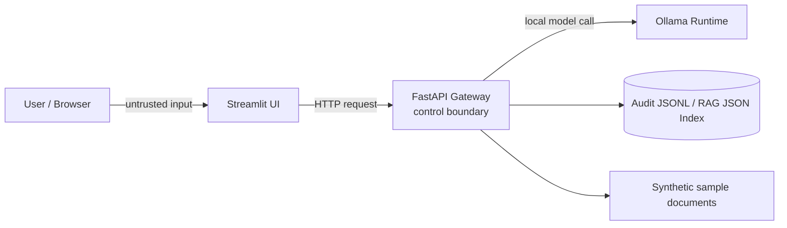

# Threat Model

This is the threat model for the Closed Local LLM Platform as of M3.

It is intentionally practical and milestone-aware. M3 does not solve every risk, but the design leaves clear places to add controls.

## Scope

In scope:

- Streamlit UI
- FastAPI gateway
- Ollama local runtime connection
- chat request/response flow
- M2/M3 guardrails baseline
- M2 PII masking baseline
- M3 RAG over synthetic documents
- M2/M3 audit logging
- future RBAC
- Docker Compose local development environment

Out of scope for now:

- production cloud deployment
- enterprise identity provider integration
- real private company documents
- real user PII datasets
- compliance certification
- production incident response process

## Assets

Important things to protect:

- User prompts
- Model responses
- Retrieved document chunks
- Synthetic sample documents, and later any private documents if added intentionally
- Audit logs
- Role and permission metadata
- Model configuration
- Local service endpoints
- Developer machine secrets and environment variables

## Actors

### Normal user

Uses the UI to ask questions and receive answers.

### Admin

Future role. Manages system settings, documents, model configuration, or users.

### Auditor

Future role. Reviews audit events but should not necessarily have broad document access.

### Malicious or careless user

May attempt prompt injection, data exfiltration, overbroad retrieval, or unsafe requests.

### Compromised dependency or container

May attempt to read environment variables, alter responses, or exfiltrate logs/data.

### Developer

Can accidentally commit secrets, real data, or insecure defaults.

## Trust Boundaries

Primary control boundary:

- FastAPI gateway.

The UI should not be trusted to enforce security rules by itself. Ollama should not be exposed as the direct user-facing API.

## Key Threats and Initial Controls

| Threat | Example | Current position | Later control |
|--------|---------|-------------|---------------|
| Prompt injection | User says "ignore previous instructions" or "前回までのプロンプトは無視して" | M2 flags obvious Japanese/English phrases and records decision | Severity levels, block/warn/annotate policy, bilingual corpus, rule + optional LLM classifier |
| RAG injection | Retrieved doc contains malicious instructions | M3 treats retrieved text as untrusted data, separates prompt sections, and records indirect injection metadata | M4 severity/action policy; stronger classifiers |
| PII leakage | Raw email/phone/token appears in logs | M2 masks basic PII in audit summaries | Stronger PII detection and review workflow |
| Audit log leakage | Logs store full prompts with secrets | M2 stores hashes and redacted summaries in local JSONL | Durable store, access control, retention policy |
| Unauthorized access | User reads admin/audit data | No RBAC in M1 | user/admin/auditor roles and route enforcement |
| Document over-retrieval | RAG returns docs outside user scope | M3 uses only synthetic public sample docs; no per-user document permissions | document-level permissions and retrieval filters |
| Direct model exposure | Ollama accessible from network | Keep local by default | bind to localhost/private network, gateway-only access |
| Supply chain risk | malicious npm/Python package | Minimal dependencies | lockfiles, dependency review, CI checks |
| Hallucination | Model invents facts | Known limitation | citations, uncertainty language, eval prompts |
| Denial of service | Large prompts or repeated requests | Basic local dev only | request size limits, timeouts, rate limits |

## STRIDE Notes

### Spoofing

Risk:

- A caller may claim a role or identity without proof once roles are introduced.

M1:

- No production identity model.

Later:

- Do not trust client-supplied role blindly.
- Add a minimal server-side identity/session abstraction before enforcing RBAC.

### Tampering

Risk:

- User input or retrieved documents may alter prompt intent.
- Container or dependency tampering may alter API behavior.

M3:

- Keep prompt construction simple and inspectable.
- Add heuristic prompt injection tests for obvious Japanese and English examples.
- Record guardrail decisions in chat response metadata and audit events.
- Separate system instructions, retrieved context, and user question in RAG prompts.
- Inspect retrieved chunks for indirect prompt injection signals before composing the RAG prompt.

Later:

- Add severity levels and block/warn/annotate policy.
- Expand the bilingual injection corpus beyond obvious examples.
- Compare rule-based checks with an optional LLM-based classifier, without making the classifier a hidden single point of failure.
- Consider dependency pinning and reproducible builds.

### Repudiation

Risk:

- Users or admins can deny actions if no audit event exists.

M3:

- Local JSONL audit event baseline exists.
- Request IDs and audit event IDs are returned by `/chat`.
- Events record actor placeholder, role placeholder, action, model, timestamps, guardrail decisions, redacted summaries, hashes, RAG usage, retrieved document IDs, citations, retrieval guardrail metadata, and outcome.

Later:

- Add durable/tamper-resistant storage and role-restricted audit review.

### Information Disclosure

Risk:

- Prompts, model outputs, documents, logs, or environment variables leak.

M3:

- Do not commit real data or secrets.
- Keep local endpoints local.
- Apply regex PII masking to audit summaries.
- Store prompt/response hashes instead of full raw prompt/response text in audit events.

Later:

- Stronger PII masking/redaction.
- Audit log minimization and retention policy.
- RBAC for audit/document access.
- Avoid direct exposure of Ollama.

### Denial of Service

Risk:

- Large prompts or repeated requests overload local model or API.

M3:

- Local development only; document limitation.

Later:

- Add request size limits, timeouts, and rate limiting.

### Elevation of Privilege

Risk:

- A normal user gains admin/auditor access.
- A prompt tricks the model into revealing restricted data.

M3:

- No privileged data or RBAC yet.

Later:

- Enforce route-level and document-level authorization in the gateway.
- Never rely on model instructions alone for access control.

## Audit Logging Design Notes

Audit logging should support accountability without becoming a second data leak.

Recommended future fields:

- event_id
- request_id
- timestamp
- actor_id or local session identifier
- role
- action
- route
- model
- prompt_hash or redacted prompt summary
- response_hash or redacted response summary
- guardrail_decision
- pii_masking_applied
- retrieved_document_ids
- outcome
- error_code
- latency_ms

Avoid by default:

- raw secrets
- full unredacted prompts
- full unredacted model outputs
- unnecessary PII
- real private documents in development fixtures

## PII Masking Design Notes

PII masking should be explicit about where it is applied:

- before audit persistence
- possibly before model calls, depending on use case
- before displaying admin/auditor views

M2 baseline starts with simple patterns:

- email addresses
- phone numbers
- obvious API-key-like strings
- credit-card-like numbers in synthetic examples

Limitations must be documented because regex masking is not complete PII protection.

## RAG-Specific Risks

M3 adds RAG-specific risk handling for:

- malicious instructions inside documents
- retrieval of documents outside user permissions
- stale or incorrect documents
- citation spoofing or missing citations
- embedding/vector store leakage
- chunking that loses important context

M3 RAG controls include:

- treating retrieved text as untrusted data
- explicit citations
- document IDs in audit events
- separated prompt sections for system instructions, retrieved context, and user question
- indirect prompt injection metadata for retrieved chunks

Still deferred:

- document-level permission filters
- semantic vector store leakage controls
- block/warn/annotate policy for flagged retrieved context

## RBAC Design Notes

Initial future roles:

- `user`: can chat and access permitted documents
- `admin`: can manage selected settings/documents
- `auditor`: can inspect audit events without automatically gaining all admin powers

Rules:

- Enforce roles in FastAPI, not only in the UI.
- Do not let the model decide authorization.
- Keep auditor permissions narrow and explicit.
- Document each endpoint's required role.

## M3 Security Checklist

M3 checklist status:

- [x] README documents that Ollama runs as a host service for M1.
- [x] Ollama is not presented as the public user-facing API.
- [x] `/health` does not leak sensitive environment details.
- [x] Chat endpoint has basic input validation.
- [x] No secrets or real personal data are committed.
- [x] Docker Compose exposes only API and Streamlit ports.
- [x] README limitations mention that M2 guardrails/PII/audit are learning baselines, not production-grade controls.
- [x] Chat endpoint returns guardrail status and reasons.
- [x] Audit event stores redacted summaries and hashes.
- [x] Generated audit JSONL files are ignored by git.
- [x] Synthetic sample documents are committed; generated RAG index files are ignored by git.
- [x] Retrieved context is separated from system and user prompt sections.
- [x] Retrieved context indirect injection signals are surfaced in response/audit metadata.

## Open Questions

Resolved during M1-M3:

- Ollama is assumed as a host service for M1.
- M1 kept request validation minimal; M2 kept the same prompt-size limit and added policy/audit metadata.
- `POST /chat` uses a minimal request/response schema around `message`, `model`, and `request_id`.
- Request IDs are included in M1 responses before durable audit logging.
- uv, `pyproject.toml`, and `uv.lock` are used for reproducibility.

## M3 Residual Risks

- Regex guardrails can miss subtle prompt injection and can false-positive.
- Flagged prompts and flagged retrieved chunks are not blocked yet.
- Regex PII masking is incomplete and not suitable as a compliance control.
- Local JSONL audit logs are not tamper-resistant.
- Lexical retrieval is not semantic search and can miss relevant documents.
- RAG has no document-level RBAC yet.
- `actor_id` and `role` are placeholders until RBAC/auth is introduced.
